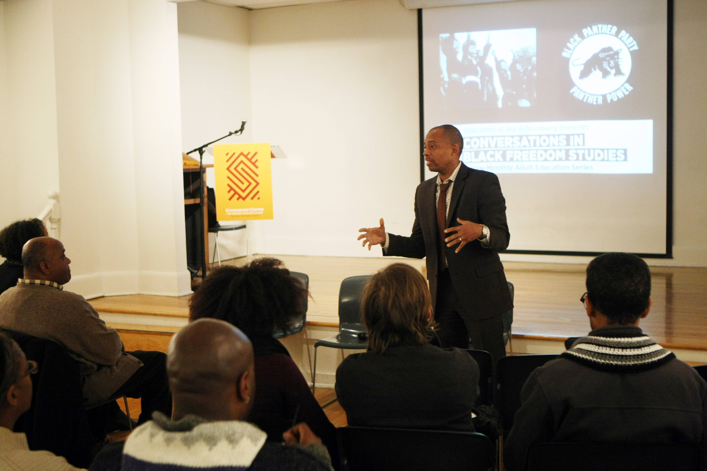
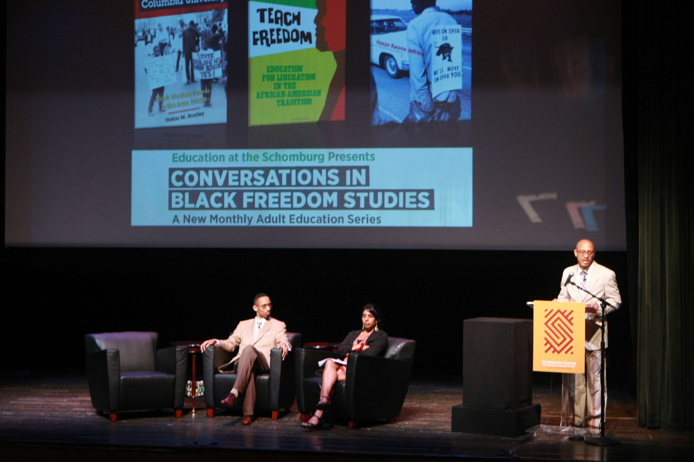

**Conversations in Black Freedom Studies** is a monthly roundtable discussion at the Schomburg Center with authors and experts in Black history. Held on the first Thursday of the month at 6:30 PM, these conversations focus on a theme—from the Jim Crow North to the Black Panther Party, from educational inequality to the Black Arts Movement. They are geared for New York City teachers, parents, students, scholars, activists, and policy-makers. Black Freedom Studies has introduced a new paradigm for research and scholarship on the long Black revolt, challenging older conceptions of geography, leadership, ideology, culture and chronology to deepen popular understandings of the scope of the Black freedom struggle. With the closing of a number of Black bookstores, there are fewer spaces where a diversity of people can gather to hear and discuss new scholarship in African American history. CBFS aims to help fill that need.

## Attend and watch

All conversations are free and open to the public. They take place on the first Thursday of the month at 6:30 PM; recent seasons have been held online. Each event page links to registration when it opens. See the [upcoming conversations](/events/) and the full archive back to 2013.

Recordings of past conversations are on our [Recordings](/resources/) page and the [Schomburg Center's YouTube playlist](https://www.youtube.com/playlist?list=PLpjTCMOQ1XpXnSUULh7ti4j5lzo20L3vS).

## Curators and support

The series was founded by Professors [Jeanne Theoharis](https://www.brooklyn.cuny.edu/web/academics/faculty/faculty_profile.jsp?faculty=510) (Brooklyn College, CUNY) and [Komozi Woodard](https://www.sarahlawrence.edu/faculty/woodard-komozi.html) (Sarah Lawrence College). Jeanne Theoharis continues as curator and is joined by [Robyn C. Spencer-Antoine](https://robyncspencer.com/) (Lehman College, CUNY) as co-curator; Komozi Woodard continues to advise the series from an emeritus position.

CBFS is supported by the Schomburg Center for Research in Black Culture and the City University of New York (CUNY) Graduate Center, with additional support from the Deutsche Bank Americas Foundation.

## Dimensions of Black Freedom Studies

### Intergenerational findings

One dimension of the series is the significance of the **intergenerational findings** that have emerged in the research. The new paradigm suggests a dramatically different chronology in Black Freedom Studies, one that spans at least two generations. For instance, Amiri Baraka's mentors included not only Sterling Brown and Margaret Walker from the Popular Front generation but also Langston Hughes from the Harlem Renaissance.

### The Harlem grassroots intellectual tradition

Another aspect of Black Freedom Studies is the **importance of the Harlem grassroots intellectual tradition**. For far too long, Malcolm X has been neglected as a working-class intellectual, and as representative of a grassroots intellectual tradition that predated Antonio Gramsci. The work on Hubert Harrison, the Socrates of the Harlem Renaissance, and on the use of the *Negro World* as a vehicle for a mass self-education movement, provides another important window into that tradition. Mass self-education was the groundwork for the "*Each One Teach One*" practices of the Black Arts Renaissance and the Black Power Movement, with their countless liberation schools, student study circles, museums, libraries and salons. These discussions may be helpful to teachers, parents and students facing the challenges of austerity policies.

### An emphasis on culture

A third dimension of Black Freedom Studies is the **promising emphasis on culture**, centering on the Black Arts Renaissance. *Harlem has been grossly neglected in the new Black Arts Movement scholarship*, and that neglect distorts the contours of the research. The pioneers and veterans of the Black Arts Renaissance in Harlem—among them Sam Anderson, Jitu Weusi, Ted Wilson, Amiri Baraka and Sonia Sanchez—are central to that history, and recorded conversations with them and about their work serve as primary sources for the scholarship to come. The Nuyorican Arts Renaissance flowered at times alongside and at times within the Black Arts Movement; Felipe Luciano and the Last Poets illuminate it from that vantage point. Askia Touré was also a pioneer of the Black Arts Movement. Harlem was the home of Langston Hughes, who cultivated the groundwork for many features of the Black Arts Renaissance, including its international character. And figures like Elombe Brath, whose political and cultural work in Black culture and consciousness began to flower in the 1950s and drew many African liberation leaders to Harlem, deserve far more attention. Amiri Baraka's *Blues People* (1963) remains a touchstone: a symposium at Sarah Lawrence College marking its fortieth anniversary drew an overwhelming response.

### Political activism and public policy alternatives

A fourth aspect of Black Freedom Studies is the **importance of political activism and public policy alternatives** in the Black revolt in the Jim Crow North. Johanna Fernández has highlighted the way the Young Lords used mass media to dramatize long-dormant public policy problems like lead paint and to win crucial changes. The Young Lords were "in the tradition" of SNCC and the civil rights revolution, as were Brooklyn and Bronx CORE. From the citizenship schools to the liberation schools, Black Power aimed to train generations in not only self-worth but also self-governance.

### Economic struggles

A fifth characteristic of Black Freedom Studies is its **attention to economic struggles**, captured in anthologies such as *The Business of Black Power* and *Black Power at Work*. In many ways, the story of the genius of Black labor remains untold. These conversations also take up the rekindled debates about the nature of internal colonialism.

### Women's leadership and the organizing tradition

A sixth feature of Black Freedom Studies is the **strategic importance of women's leadership and the organizing tradition**, the subject of phenomenal new work including *Sisters in the Struggle* and *Want to Start a Revolution? Radical Women in the Black Freedom Struggle*.

### Rethinking Malcolm X

A seventh aspect of Black Freedom Studies is **rethinking Malcolm X**. Manning Marable's Pulitzer Prize–winning biography, *Malcolm X: A Life of Reinvention* (2011), sparked controversy and a wave of new discussion. Malcolm X is at the center of rethinking Black Power, so conversations that build intellectual consensus on that research agenda are essential. With the Malcolm X papers at hand, there is no place better suited for them than the Schomburg.

### Black internationalism

An eighth dimension is **Black internationalism**, and no community is better positioned than Harlem to appreciate that the local is also international. Michael West edited *From Toussaint to Tupac: The Black International Since the Age of Revolution*. Brent Hayes Edwards made a major contribution with *The Practice of Diaspora: Literature, Translation, and the Rise of Black Internationalism*, and Tyler Stovall complements that conversation with *Paris Noir: African Americans in the City of Light*.

### The National Black Agenda

Finally, the 1972 National Black Political Convention in Gary, Indiana, and its **National Black Agenda** invite conversations about public policy and self-governance, then and now.
